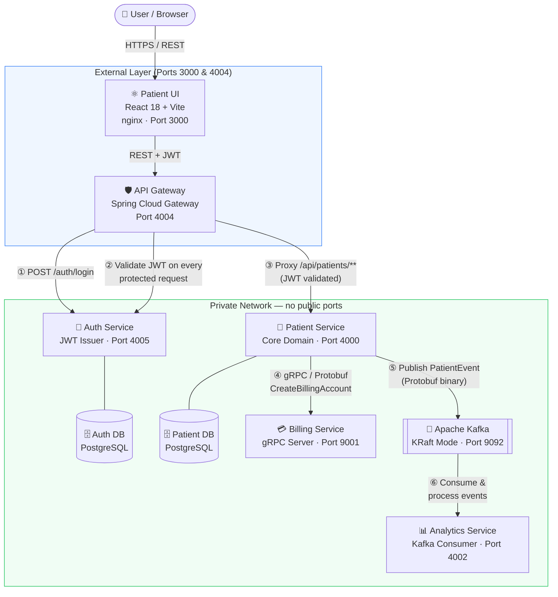

# Patient Management Microservices Platform

> A production-grade, cloud-native backend platform demonstrating a **polyglot microservices architecture** with centralized security, hybrid inter-service communication, and a fully automated Kubernetes CI/CD pipeline — built to internship-ready DevOps standards.

[](https://openjdk.org/projects/jdk/21/)
[](https://spring.io/projects/spring-boot)
[](https://react.dev/)
[](https://kind.sigs.k8s.io/)
[](https://github.com/features/actions)
[](https://www.docker.com/)

---

## Table of Contents

1. [Architecture](#architecture)
2. [Key DevOps & Engineering Features](#key-devops--engineering-features)
3. [Technology Stack](#technology-stack)
4. [Project Structure](#project-structure)
5. [Getting Started — Docker Compose](#getting-started--docker-compose)
6. [Kubernetes Deployment](#kubernetes-deployment)
7. [CI/CD Pipeline](#cicd-pipeline)
8. [API Documentation](#api-documentation)
9. [Security Model](#security-model)

---

## Architecture

The platform is composed of **6 independent microservices** behind a single API Gateway. Services communicate using a **hybrid protocol model**: synchronous **gRPC/Protobuf** for real-time billing calls and asynchronous **Apache Kafka/Protobuf** for analytics event streaming. No internal service is exposed to the public network.



### Request Lifecycle

| Step | Event | Protocol |
|------|-------|----------|
| ① | User logs in — Gateway forwards to Auth Service | REST / JSON |
| ② | JWT returned; stored in browser `localStorage` | — |
| ③ | Every patient API call passes through Gateway's JWT filter | REST / JSON |
| ④ | On patient creation, Patient Service calls Billing synchronously | **gRPC / Protobuf** |
| ⑤ | A `PatientCreated` event is published to Kafka after creation | **Kafka / Protobuf** |
| ⑥ | Analytics Service consumes and processes the event asynchronously | Kafka consumer group |

---

## Key DevOps & Engineering Features

### Infrastructure as Code
All infrastructure is declared in version-controlled manifests. Switching from development to production is a single command change, not a manual process.
- **Docker Compose** — full stack launched with one command; `.env` externalises all secrets
- **Kubernetes manifests** (`k8s/`) — 12 YAML files covering Namespaces, ConfigMaps, Secrets, PVCs, Deployments, and Services; applied in dependency order via numeric prefixes (`00-`, `01-`, …)

### Multi-Stage Docker Builds
Every Java service Dockerfile uses a **two-stage build**:
1. `maven:3.9.9-eclipse-temurin-21` — compiles and packages the JAR
2. `eclipse-temurin:21-jre-alpine` — ships only the JRE and the JAR (~200 MB vs ~600 MB single-stage)

The React UI follows the same pattern: Node for building, **nginx:alpine** for serving — resulting in a ~25 MB production image.

### Ephemeral Kubernetes Environments in CI
The GitHub Actions K8s workflow (`k8s-test.yml`) spins up a **full, isolated Kind cluster on every push**. It builds all Docker images, loads them into the cluster without a registry, applies all manifests, and tears the cluster down automatically — proving that the K8s configuration is always deployable.

### Hybrid Inter-Service Communication
- **gRPC + Protobuf** (`billing_service.proto`) for the Patient → Billing call: strongly typed, binary-serialised, low-latency
- **Apache Kafka + Protobuf** (`patient_event.proto`) for the Patient → Analytics stream: decoupled, ordered, replay-capable

### Network Perimeter Security
The `docker-compose.yml` and K8s manifests deliberately expose **only two ports** to the outside world:

| Port | Service | Accessible from |
|------|---------|-----------------|
| `4004` | API Gateway | Public (browser) |
| `3000` | React UI | Public (browser) |

All databases, Kafka, gRPC ports, and internal REST ports sit on a private bridge network / ClusterIP, unreachable from outside the cluster.

### Centralised JWT Validation
Authentication logic lives **once** — in `JwtValidationGatewayFilterFactory`. Every protected route passes through this filter before reaching any downstream service. Individual services contain zero authentication code.

### Spring Boot Actuator Health Probes
All five Spring Boot services expose `/actuator/health`. Kubernetes liveness and readiness probes use this endpoint, enabling self-healing pod restarts without any manual intervention.

---

## Technology Stack

| Layer | Technology | Role |
|-------|-----------|------|
| **API Gateway** | Spring Cloud Gateway 2024.0 | Routing, JWT filter, CORS |
| **Auth Service** | Spring Boot 3.4.1, Spring Security, JJWT 0.12 | Token issuance & validation |
| **Patient Service** | Spring Boot 3.4.1, Spring Data JPA | Core domain CRUD |
| **Billing Service** | Spring Boot 3.4.1, grpc-spring-boot-starter | gRPC server, billing accounts |
| **Analytics Service** | Spring Boot 3.4.1, Spring Kafka | Event stream consumer |
| **Frontend** | React 18, Vite 5, Tailwind CSS 3, Axios | SPA, protected routes |
| **Databases** | PostgreSQL 15 | Patient data, auth users |
| **Messaging** | Apache Kafka (KRaft mode) | Async event streaming |
| **Serialisation** | Protocol Buffers (Protobuf 3.25) | gRPC contracts, Kafka payloads |
| **Containerisation** | Docker, Docker Compose | Local dev & compose stack |
| **Orchestration** | Kubernetes (Kind for CI), kubectl | Production-style deployment |
| **CI/CD** | GitHub Actions | Build → Deploy → Test pipeline |
| **Integration Tests** | REST-Assured, JUnit 5 | Black-box API validation |
| **API Docs** | SpringDoc OpenAPI / Swagger UI | Live spec, exposed via Gateway |
| **Runtime** | Java 21 (Virtual Threads capable), Node 20 | JRE + frontend build |

---

## Project Structure

```
patient-management-microservices/
├── api-gateway/              # Spring Cloud Gateway — routing & JWT filter
├── auth-service/             # JWT issuer, user login, token validation
├── patient-service/          # Patient CRUD, gRPC client, Kafka producer
├── billing-service/          # gRPC server — creates billing accounts
├── analytics-service/        # Kafka consumer — processes patient events
├── patient-ui/               # React SPA — Login, Dashboard, Add Patient
├── integration-tests/        # REST-Assured black-box tests (run vs live stack)
├── k8s/                      # Kubernetes manifests (numbered, apply in order)
│   ├── 00-namespace.yml
│   ├── 01-configmap.yml      # All non-sensitive environment config
│   ├── 02-secrets.yml        # DB passwords, JWT secret
│   ├── 03-postgres-patient.yml   # PVC + Deployment + Service
│   ├── 04-postgres-auth.yml
│   ├── 05-kafka.yml          # KRaft mode, single replica
│   ├── 06-auth-service.yml
│   ├── 07-patient-service.yml
│   ├── 08-billing-service.yml    # Exposes gRPC port 9001 + HTTP 4001
│   ├── 09-analytics-service.yml
│   ├── 10-api-gateway.yml    # NodePort 30004
│   └── 11-patient-ui.yml     # NodePort 30000
├── .github/workflows/
│   ├── ci.yml                # Docker Compose integration tests
│   └── k8s-test.yml          # Kind cluster end-to-end tests
└── docker-compose.yml
```

---

## Getting Started — Docker Compose

### Prerequisites
- **Docker** ≥ 24 and **Docker Compose** v2
- A `.env` file in the project root (see below)

### 1. Configure environment variables

The `.env` file holds all secrets and is never committed to version control.

```env
# Patient Database
DB_USER=admin
DB_PASSWORD=my_super_secret_password
DB_NAME=patientdb

# Auth Database
AUTH_DB_USER=auth_admin
AUTH_DB_PASSWORD=auth_password
AUTH_DB_NAME=authdb

# JWT Signing Key (use a long, random string in production)
JWT_SECRET=ThisIsMySuperSecretKeyForSigningMyTokens1234567890
```

### 2. Start the full stack

```bash
docker compose up --build
```

This starts **9 containers** in the correct dependency order: two PostgreSQL instances, Kafka, five Spring Boot services, and the nginx-served React UI.

| Service | Local URL |
|---------|-----------|
| React UI | http://localhost:3000 |
| API Gateway | http://localhost:4004 |
| Swagger — Patient API | http://localhost:4004/api-docs/patients |
| Swagger — Auth API | http://localhost:4004/api-docs/auth |

### 3. Default login credentials

The auth database seeds a test user on first run:

```
Email:    testuser@test.com
Password: password123
```

### 4. Run the integration tests

With the stack running, open a second terminal:

```bash
cd integration-tests
./mvnw clean test
```

The suite performs black-box API tests against the live stack — no mocks, no stubs.

| Test | What it validates |
|------|-------------------|
| `shouldReturnOKWithValidToken` | Full login flow returns a non-null JWT |
| `shouldReturnUnauthorizedOnInvalidLogin` | Gateway correctly rejects bad credentials (401) |
| `shouldReturnPatientsWithValidToken` | JWT-authenticated patient list returns HTTP 200 |

---

## Kubernetes Deployment

### Prerequisites
- **kubectl**, **kind** ≥ 0.25

### Deploy to a local Kind cluster

```bash
# 1 — Create the cluster
kind create cluster --name healthcare-cluster

# 2 — Build all Docker images
docker build -t auth-service:latest     ./auth-service
docker build -t patient-service:latest  ./patient-service
docker build -t billing-service:latest  ./billing-service
docker build -t analytics-service:latest ./analytics-service
docker build -t api-gateway:latest      ./api-gateway
docker build -t patient-ui:latest       ./patient-ui

# 3 — Load images into Kind (no registry needed)
for svc in auth-service patient-service billing-service \
           analytics-service api-gateway patient-ui; do
  kind load docker-image $svc:latest --name healthcare-cluster
done

# 4 — Apply manifests in dependency order
kubectl apply -f k8s/

# 5 — Watch pods become Ready
kubectl get pods -n healthcare -w
```

### Access services from your machine

```bash
# API Gateway
kubectl port-forward svc/api-gateway 4004:4004 -n healthcare &

# React UI
kubectl port-forward svc/patient-ui 3000:80 -n healthcare &
```

Alternatively use the NodePorts directly:
- React UI → `http://localhost:30000`
- API Gateway → `http://localhost:30004`

### Kubernetes manifest design decisions

| Decision | Reason |
|----------|--------|
| `imagePullPolicy: IfNotPresent` | Uses the locally loaded image; prevents failed pulls from Docker Hub |
| `ConfigMap` for all env config | Single source of truth; changing one value redeploys cleanly |
| `Secret` with `stringData:` | Plain-text input, K8s handles base64 encoding automatically |
| `PersistentVolumeClaim` for DBs | Database data survives pod restarts |
| `NodePort` for Gateway & UI only | All other services are `ClusterIP` — private by design |
| Numbered file names (`00-`, `01-`) | `kubectl apply -f k8s/` applies in correct dependency order |

---

## CI/CD Pipeline

Two independent GitHub Actions workflows run on every push to `main`.

### Workflow 1 — `ci.yml` (Docker Compose)

```
Checkout → Build Docker images → docker compose up → Wait 90s → Run integration tests
```

Fast feedback loop using Docker Compose. Tests run against the full stack within a single `ubuntu-latest` runner.

### Workflow 2 — `k8s-test.yml` (Kubernetes)

```
Checkout → Set up JDK 21 → Create Kind cluster
  → Build 6 Docker images → kind load (all images)
    → kubectl apply -f k8s/ (12 manifests)
      → Wait for Postgres & Kafka → Wait for all pods Ready
        → kubectl port-forward api-gateway → Run integration tests
```

This workflow validates that every K8s manifest is syntactically correct, that the cluster wires up correctly, and that the integration tests pass against a **real Kubernetes environment** — not a mock. The entire cluster is ephemeral; it is created and destroyed with each run.

```yaml
# Key step — proves K8s networking works end-to-end
- name: Port-forward API Gateway
  run: |
    kubectl port-forward svc/api-gateway 4004:4004 -n healthcare &
    sleep 5

- name: Run integration tests
  run: |
    cd integration-tests
    ./mvnw clean test -Dgateway.url=http://localhost:4004
```

The `gateway.url` system property makes the test suite target-agnostic — the same tests run against Docker Compose locally and against Kind in CI.

---

## API Documentation

**Swagger UI** is exposed through the API Gateway and auto-generates from source annotations — no manual upkeep required.

| Service | Swagger UI | OpenAPI JSON |
|---------|-----------|--------------|
| Patient API | http://localhost:4004/swagger-ui.html | http://localhost:4004/api-docs/patients |
| Auth API | http://localhost:4004/api-docs/auth | http://localhost:4004/api-docs/auth |

### Core endpoints

```
POST   /auth/login              Authenticate; returns a signed JWT
GET    /auth/validate           Validate a JWT (used internally by the Gateway filter)

GET    /api/patients            List all patients          [JWT required]
POST   /api/patients            Create a new patient       [JWT required]
PUT    /api/patients/{id}       Update patient details     [JWT required]
DELETE /api/patients/{id}       Remove a patient record    [JWT required]
```

### Example — login and fetch patients

```bash
# 1. Authenticate
TOKEN=$(curl -s -X POST http://localhost:4004/auth/login \
  -H "Content-Type: application/json" \
  -d '{"email":"testuser@test.com","password":"password123"}' \
  | jq -r '.token')

# 2. Fetch patients with the JWT
curl http://localhost:4004/api/patients \
  -H "Authorization: Bearer $TOKEN"
```

---

## Security Model

```
Internet
   │
   ▼
┌─────────────────────────────────┐
│ API Gateway  :4004              │  ← Only entry point; enforces JWT on all
│ JWT Validation Filter           │    /api/** routes before forwarding
└────────────┬────────────────────┘
             │ Private network
    ┌────────┼─────────────────┐
    ▼        ▼                 ▼
 Auth    Patient           Billing
 :4005   :4000             :9001 gRPC
   │        │
   ▼        ▼
 Auth DB  Patient DB       Kafka :9092
```

- **Zero-trust perimeter** — only the Gateway has a public port
- **Stateless JWT** — no server-side session; Gateway validates the signature on every request
- **Private network isolation** — internal services communicate only on the Docker bridge network / Kubernetes ClusterIP; no cross-service port is reachable from outside
- **Non-root containers** — all Java service Dockerfiles create a `spring` user and drop root before running the JVM
- **Secret management** — all credentials live in `.env` / Kubernetes `Secret` objects, never in source code
